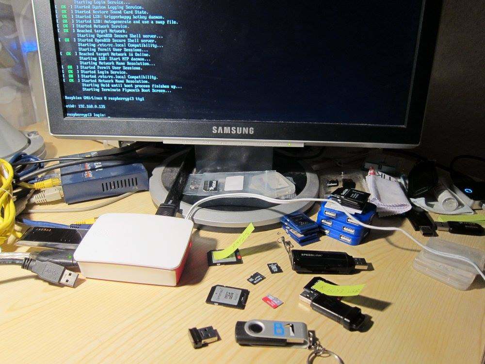

# Entwicklungsumgebung

*raspiBackup* wird primär auf einem Linux Desktop entwickelt, aber dann
natürlich auf einer richtigen Raspberry getestet. Dazu gibt es verschiedene
vorerstellte RaspbianOS Images auf einer Platte, die mit *raspiBackup* restored
werden und dann werden die neuen bzw geänderten Funktionen von *raspiBackup*
manuell getestet. Irgendwann steht auch wieder eine neue Version von
*raspiBackup* an, allgemein verfügbar zu machen. Zu Anfang wurden dann immer
alle möglichen Testvarianten zu Fuß durchgetestet. Aber schliesslich ist das
ziemlich zeitaufwändig und es werden dabei ziemlich viele SD Karten dabei immer wieder verschlissen.
Deshalb werden die [Regressiontests](regressiontests-executed.md) in einer auf dem Desktop [simulierten
Raspberry](https://www.linux-tips-and-tricks.de/de/raspberryd/22-wie-kann-man-raspberry-pi-unter-kvm-emulieren) vorgenommen. Das geht wesentlich schneller und seitdem geht auch
nicht mehr so häufig eine SD kaputt.

Auf dem nachfolgenden Photo sieht man eine Raspberry 3B die zum Testen benutzt wird sowie diverse SD Karten und -größen und USB Sticks.



Sämtlicher Sourcecode wird in einem lokalen git Repository gewartet. Neue
Releases entstehen in einem Developmentzweig. Wenn eine neue Release fertig
ist, um allgemein verfügbar zu machen und alle Regressiontests erfolgreich
durchgelaufen, wird die neue Version als Beta verfügbar gemacht, damit
*raspiBackup* Benutzer die neue Version testen und Feedback geben können.
Ausserdem wird die Beta auf meinen lokalen Raspberries eingesetzt. Nach ca 4
Wochen wird der neue Code in den Master Zweig übernommen und die neue Version
veröffentlicht. *raspiBackup* ist Open Source und desshalb werden alle Releases
im [github](https://github.com/framps/raspiBackup) synchronisiert. Dazu gehört auch der Developmentzweig der von Zeit
zu Zeit synchronisiert wird.

*raspiBackup* schreibt seine git Codeversion (commit sha) in die folgenden Meldung RBK0009I

```
--- RBK0009I: raspifix: raspiBackup.sh V0.6.3.2 (5c98a16) started at Sun Jun  3 09:46:08 CEST 2018
```

Die hexadezimale Zahl in Klammern (5c98a16 in diesem Beispiel) erlaubt, den
dazugehörigen Code anzusehen, wann immer ein Problem mit *raspiBackup* berichtet
wird und ich kann die Problemursache suchen. Darum ist es wichtig, die Meldung
RBK0009I in jedem Problembericht zu erwähnen. Ausserdem ist es dadurch
möglich, auf diesem Codestand einen Hotfix zu bauen. Das wird in der Regel
gemacht und der Hotfix verifiziert, bevor er  in das nächste Release
einfliesst.

Die meisten Probleme werden in [github](https://github.com/framps/raspiBackup/issues) verwaltet. Für jedes neue Release gibt
es [hier auf GitHub](https://github.com/framps/raspiBackup/releases) eine Zusammenfassung der Bugfixes und neuer Funktionalität.


[.status]: rst
[.source]: https://www.linux-tips-and-tricks.de/de/raspibackupcategoried/516-raspibackup-entwicklungsumgebung
[.source]: https://www.linux-tips-and-tricks.de/en/raspibackupcategorye/517-raspibackup-developmentenvironment
