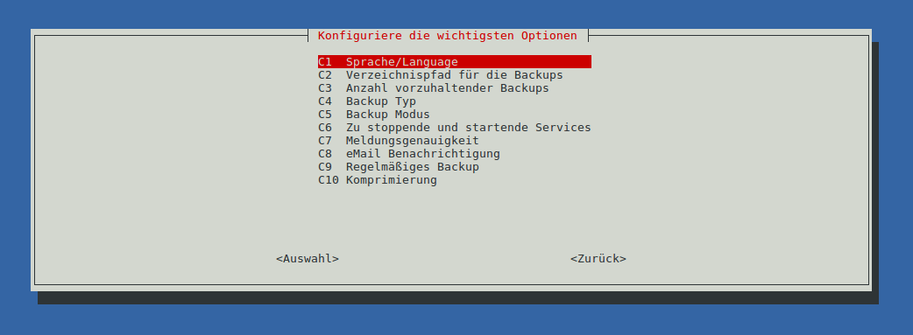

# raspiBackup Schnellstart - Installation in 5 Minuten

Hinweis: Es gibt vom *raspiBackup*-User [Franjo_G](https://forum-raspberrypi.de/user/57610-franjo-g/) eine schöne Anleitung,
wie man *raspiBackup* installiert, konfiguriert und ein Backup restored.
Bevor hier alles dupliziert wird: [Seine Anleitung](https://forum-raspberrypi.de/article/7-raspibackup-installation-grundeinstellungen-erstes-backup-und-restore/) im deutschen Raspberryforum.

Die Dokumentation von *raspiBackup* ist durch Erweiterungswünsche von Benutzern
mittlerweile sehr umfangreich geworden. Auf dieser Seite wird deshalb kurz und
knapp Schritt für Schritt erklärt, wie man *raspiBackup* direkt benutzt, um sofort
ein Backup zu erstellen oder in 5 Minuten *raspiBackup* installiert und
konfiguriert und dann ein Backup der Raspberry erstellen kann.

Das [Wiederherstellen](restore.md) ist detailliert für die unterschiedlichen Benutzer mit
ihren jeweiligen primären Platformen (Linux, Mac oder Windows) beschrieben.

Nachdem man dann sowohl den Backup als auch den Restore getestet hat und
geprüft hat, welche Services vor dem Backup gestoppt werden müssen, lässt man
dann *raspiBackup* automatisch im gewünschten Intervall per *systemd timer*
laufen.

Danach kann man in einer stillen Stunde sämtliche Möglichkeiten von
*raspiBackup* hier nachlesen und die Konfiguration den speziellen Bedürfnissen
anpassen. In jedem Falle sollte jeder sich die [FAQs](faq.md) durchlesen. Der
*raspiBackup* Installer ermöglicht auch *raspiBackup* wieder komplett zu
deinstallieren falls sich nach der Installation und beim Test herausstellen
sollte, dass *raspiBackup* nicht den Anforderungen genügt.

**Hinweis:**  5 Minuten braucht jemand, der Basiskenntnisse von Linux hat. Wer diese
nicht hat, braucht natürlich länger trotz dass der Installer hilft, eine
*raspiBackup* Anfangskonfiguration schnell zu erstellen - leider.

Vor der Nutzung von *raspiBackup* bitte erst lesen: [Unterstützte Hard- und Software](supported-hardware-and-software.md)

Die Supportkanäle [sind hier beschrieben](main.md#kontakt)

## Anwendungs- und Konfigurationsbeispiele

Auf dieser Seite werden verschiedene Beispiele gegeben wie man *raspiBackup* bei
sich einsetzen kann. Diese Beispiele sollten sich vor der eigentlichen
Installation angesehen werden, um bei der Konfiguration während der Installation
die richtigen Parameter zu benutzen.

## *raspiBackup* installieren und automatisch regelmäßig ein Backup erstellen

*raspiBackup* hat einen UI installer, mit dem sich *raspiBackup* wie mit
`raspi-config` recht einfach installieren und die primären Optionen konfigurieren
lassen. Alle weiteren Optionen müssen in der Konfigurationsdatei
`/usr/local/etc/raspiBackup.conf` mit einem Editor konfiguriert werden. Ausserdem
lassen sich recht einfach jederzeit die primären Optionen durch erneuten Aufruf
von `raspiBackupInstallUI` nachträglich ändern. Dazu gehört auch eine
Updatefunktion für den Installer sowie für *raspiBackup*. Die
Installationsführung erfolgt über Menus sowie Auswahllisten. Die Menüsprache
kann Deutsch, Englisch. Finnisch, Chinesisch oder Französisch sein.

Wer *raspiBackup* einfach nur mit einer Standardkonfiguration ohne individuelle
Konfiguration schnell installieren will, kann das mit den Aufrufoptionen `-i` und
`-e` starten (`-h` fuer Hilfe benutzen). Danach kann der Installer genutzt werden um
die Basiskonfiguration von *raspiBackup* vorzunehmen bzw zu ändern.
Eine [Manuelle Installation und Konfiguration](manual-installation-and-configuration.md) ist ebenfalls möglich.
Auf Youtube existiert auch ein Video, auf dem *raspiBackup* vorgestellt wird
sowie am Ende eine Demo der Installation von *raspiBackup* gegeben wird.

Zum Download, der Installation und Start des *raspiBackup* Installers folgendes
auf der Raspberry in der Befehlszeile eingeben:

    curl -o install -L https://raspibackup.linux-tips-and-tricks.de/install; sudo bash ./install

**Hinweis**: Es existiert auch eine [Anleitung](manual-installation-and-configuration.md),
um *raspiBackup* manuell ohne `sudo` Nutzung zu installieren.

Danach kann man die Installation wählen, bei der eine Standardkonfiguration
benutzt wird. Anschliessend ist es möglich, die wesentlichen
Standardkonfigurationsoptionen im Konfigurationsmenu zu ändern. Zum Schluss
kann man die wöchentliche Sicherung mit *raspiBackup* einschalten.

In der Standardkonfiguration geht *raspiBackup* davon aus, dass es einen
Mountpoint `/backup` gibt, unter dem das Backupverzeichnis gemounted ist.
Diesen sollte man mit `sudo mkdir /backup` erstellen und dann dort das externe
Backupverzeichnis mounten.

Der Installer kann jederzeit wieder in der Befehlszeile mit
`sudo raspiBackupInstallUI` aufgerufen werden, um *raspiBackup* Konfigurationen
zu ändern oder auch *raspiBackup* zu deinstallieren.

**Hinweis**: Die *raspiBackup* Systemd Konfigurationsdatei ist
`/etc/systemd/system/raspiBackup.timer`. Die Systemdkonfiguration sollte immer
mit dem Installer geändert werden. Manuelle Änderungen in der Datei sollten
vorsichtig vorgenommen werden. Sie könnte dazu führen, dass der Installer die
Konfigurationsdatei nicht mehr ändern kann.

Sollte es Probleme geben: Es wird vom Installer immer ein Debuglog
`/root/raspiBackupInstallUI.log` angelegt, welches hilft,
die Problemursache zu finden.

## Installationsdemo

**Hinweis**: Finnische, französische, englische und chinesische Sprachuntertützung steht ebenfalls zur Verfügung

**Hinweis:**
Benachrichtgungen per eMail benötigen einen korrekt konfigurierten lokalen MTA
wie *postfix*, *nullmailer*, *msmtp* oder *exim4*. Wird *Pushover*, *Slack* oder *Telegram*
genutzt, muss die Konfigurationsdatei von *raspiBackup* vorher manuell
entsprechend mit den benötigten Konfigurationsdaten versehen werden. Ein
Benachrichtigungstest kann am schnellsten mit der Option `-F` durchgeführt
werden.

**Achtung:**
Ein Backup nützt nichts, wenn in dem Moment, wo man es einspielen möchte,
feststellt, dass das Backup nicht zu gebrauchen ist. Desshalb sollte man nach
dem ersten erfolgreichen Backup auch sofort den Restore testen und immer wieder
von Zeit zu Zeit den ganzen Restoreprozess durchexerzieren und damit testen, ob
die erstellten Backups OK sind und sich ein System damit funktionsfähig
restaurieren läßt. *raspiBackup* erinnert in regelmäßigen
Abständen daran einen Restoretest vorzunehmen. Das Erinnerungsintervall ist konfigurierbar. Der Standardwert
ist 6 Monate.

Besonders wichtig ist das auch, wenn ein neues System mit einem neuen
Betriebssystem wieder mit *raspiBackup* gesichert wird. Es gibt immer wieder
Änderungen bei neuen Betriebssystemversionen, die dazu beitragen können, dass der
Restore nicht mehr funktioniert.

## Downloadlinks auf *raspiBackup* und den raspiBackupInstaller

Wer sich vorher den Sourceode von *raspiBackup* und/oder den Installer
*raspiBackupInstallUI* ansehen möchte, kann sich diese über den folgenden
Downloadlink ansehen:

  - [Download *raspiBackup*](https://github.com/framps/raspiBackup/blob/master/raspiBackup.sh)
  - [Download raspiBackupInstallUI](https://github.com/framps/raspiBackup/blob/master/installation/raspiBackupInstallUI.sh)

## Erstellen und Wiederherstellen eines Backups

Nachdem *raspiBackup* installiert wurde, sind folgende Schritte notwendig um ein Backup zu erstellen.

Der Standardmountpunkt von *raspiBackup* wo die Backups abgelegt werden
(Annahme dass der Standardmountpunkt benutzt wird) wird angelegt mit

    sudo mkdir /backup

Anschließend muss ein externes Gerät (USB Platte, USB Stick, nfs Laufwerk, ...)
auf diesen Mountpoint gemounted werden. Im folgenden Beispiel wird eine externe
USB Platte bzw. ein externer USB Stick gemountet.

    sudo mount /dev/sda1 /backup

Dabei ist zu beachten, dass die Partition je nach gewünschtem Backuptyp ein
gewisses Filesystem voraussetzt. Die Anhängigkeiten sind in "[Welches Dateisystem kann auf der Backuppartition benutzt werden?](which-filesystem-can-be-used-on-the-backup-partition.md)" erklärt.
Außerdem sollte man, wenn es denn nicht unbedingt erforderlich ist, den Backuptyp *dd* vermeiden.
Details dazu finden sich in "[Warum sollte man dd als Backuptyp besser nicht benutzen?](why-shouldn-t-you-use-dd-as-backup-type.md)".

Beim ersten Backup sollte man noch prüfen, ob man auf das richtige Backupgerät
bzw. die richtige Backuppartition sichert. Hilfreich sind dabei folgende Befehle:

    sudo blkid -o list
    mount | grep backup

oder wenn man die Backuppartition lokal angeschlossen wurde und man ihr ein Label verpasst hat

    sudo blkid -o list | grep <label>

Danach ist alles fertig konfiguriert, um ein Backup zu erstellen. Dabei ist aber
zu berücksichtigen, dass, wenn man später *raspiBackup* regelmäßig einsetzt,
bestimmte Dienste gestoppt werden sollten, da sonst ein inkonsistentes Backup
entstehen könnte. Siehe dazu [FAQ18](faq.md#faq18). Braucht man keine Dienste zu stoppen oder
will man den Backup einmal schnell testen kann, man wie folgt den Backup mit
*raspiBackup* erstellen. Das kann je nach Größe der Installation und der externen
Rootpartition beim normalen Backup etwas länger dauern.

    sudo raspiBackup -m detailed

**Danach sollte unbedingt ein Restoretest durchgeführt werden** ([Link zur
Restoredokumentation](restore.md)), um zu verifizieren, dass ein konsistentes
Backup erstellti wird, und um sich mit der Restoreprozedur vertraut zu machen.

## Standardkonfiguration und Ort der Konfigurationsdatei

Der Installer erstellt folgende Dateien:

1. Konfigurationsdatei `/usr/local/etc/raspiBackup.conf`

   In dieser werden folgende Standardwerte eingestellt und können mit dem
   Installer geändert werden. Alle anderen Optionen müssen mit einem Editor
   geändert werden oder mit einer Aufrufoption überschrieben werden.

   | Option               | Einstellung          |
   |----------------------|----------------------|
   | Backuppfad           | /backup              |
   | Backupmode           | normal               |
   | Backuptyp            | rsync                |
   | Sprache              | Sprache des Systems  |
   | Zip                  | nein                 |
   | Meldungsdetail       | normal               |
   | Backupanzahl         | 3                    |
   | Services start       | keine                |
   | Services stop        | keine                |
   | Wöchentlicher Backup | nein                 |
   | Backuptag            | Sonntag              |
   | Backupzeit           | 05:00 Uhr            |

   [Aufruf und Optionen](backup-options.md) sind ausführlich beschrieben.

2. *Systemd timer* Konfiguration wird in `/etc/systemd/system/raspiBackup.timer` vorgenommen.

   Diese Datei steuert den Aufruf von *raspiBackup* und im Standardfall ist der
   wöchentliche Backup ausgeschaltet. Er kann aber mit dem Installer eingeschaltet
   werden.

3. *raspiBackup*.sh wird in `/usr/local/bin` installiert

4. *raspiBackupInstallUI.sh* wird in `/usr/local/bin` installiert

## Weitere Schritte

Nachdem das erste Backup erfolgreich erstellt und wiederhergestellt wurde,
sollte man sich in einer ruhigen Stunde über alle weiteren Optionen von
*raspiBackup* hier informieren und je nach Bedarf einsetzen. Eine hilfreiche
Option ist z.B. `-e <eMailAdresse>`. Dadurch schickt *raspiBackup* nach jedem
Backuplauf seine Meldungen per eMail an die angegebene Adresse. Weiterhin kann
man bestimmte Verzeichnisse vom Backup ausschliessen sowie `dd` Backups
verkleinern und damit beschleunigen und Diverses mehr.

Jede Option kann man in der Konfigurationsdatei `/usr/local/etc/raspiBackup.conf` definieren,
so dass beim Aufruf keine weitere Optionen angegeben werden müssen.
Es existieren auch Optionen, die sich nur über die Konfigurationsdatei einstellen lassen.
Details dazu finden sich auf der [Optionsbeschreibungsseite](backup-options.md).

Ebenfalls nützlich: [raspiBackupDialog - ein komfortables Hilfsscript für raspiBackup](raspibackupdialog-a-convenient-helper-script-for-raspibackup.md),
welches die Nutzung und den Aufruf von *raspiBackup* vereinfacht.

## Deinstallation

*raspiBackup* kann auch wieder deinstalliert werden.
Entweder benutzt man den Installer zum Deinstallieren oder folgenden Befehl:

    sudo raspiBackupInstallUI.sh -u

## Aufruf des Installers ohne Menus direkt von der Befehlszeile

Wer keine menugesteuerte Installation haben möchte kann die Installation von *raspiBackup*,
den Beispielextensions oder die Deinstallation von *raspiBackup*
von der Befehlszeile direkt aufrufen. Dabei wird die Standardkonfiguration installiert.
Der Aufruf dazu ist

    curl https://raspibackup.linux-tips-and-tricks.de/install | sudo bash -s -- -i

Jedwede Änderungen an der Konfiguration können nun manuell mit einem Editor
vorgenommen werden.
Ebenso das Einschalten des wöchentlichen Backup per systemd Timer. 
Man kann aber auch den Installer mit seinen Menus benutzen, um die
Konfiguration der primären Optionen anzupassen sowie den regulären Backup ein-
oder auszuschalten. Der Aufruf dazu ist

    sudo raspiBackupInstallUI

Weitere Details zu den verschiedenen Funktionen des Installationsskriptes
erfährt man durch den Aufruf der Hilfefunktion

    sudo raspiBackupInstallUI -h

Will man nicht systemd sondern cron nutzen existiert dafür die Option `-t`, mit der man den Daemon
auswählen kann, der die regelmäßigen Backups steuert. Es ist entweder `crond` oder
`systemd`. `systemd` ist der Default.

## *raspiBackup* soll ohne Installation direkt aufgerufen werden, um sofort ein Backup zu erstellen

1. Download von *raspiBackup* `curl -sSLO  https://www.linux-tips-and-tricks.de/raspiBackup.sh`

2. Mount der Backuppartition unter `/backup` oder Angabe der Backuppartition als letzen
   Parameter im Aufruf, also z.B. `sudo bash ./raspiBackup.sh /media/pi`

3. Start des Backups:  `sudo bash ./raspiBackup.sh`

4. Falls kein `rsync` Backup gewünscht wird, muss der Backuptyp `tar` oder `dd` mit Option `-t`
   mitgegeben werden, also `sudo bash ./raspiBackup.sh -t tar` oder `sudo bash ./raspiBackup.sh -t dd`

5. Kurzinfo zu allen Aufrufoptionen von *raspiBackup* erhält man mit `bash ./raspiBackup.sh -`

## Manuelle Installation und Konfiguration von *raspiBackup*

Siehe im gleichnamigen Kapitel: [Manuelle Installation und Konfiguration](manual-installation-and-configuration.md)

[.status]: rft
[.source]: https://linux-tips-and-tricks.de/de/installation
