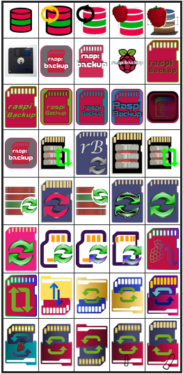

# *raspiBackup* Logo

Freundliche [Forenmitglieder](https://forum-raspberrypi.de/forum/thread/59343-wer-hat-lust-und-zeit-ein-schoeneres-icon-fuer-den-raspibackup-installer-fuer-ub/) vom [deutschen Raspberry Forum](https://forum-raspberrypi.de/forum/) haben mit Ihren Kenntnissen und großem Einsatz geholfen, ein Logo für *raspiBackup* zu erstellen.

Es stellt die SD Karte dar, die gesichert wird (jetzt ist es i.d.R. eine SSD -
aber als *raspiBackup* entstand, war es immer eine SD Karte). Der rote Ordner
unten ist der Backupordner. Und die kleine Büroklammer unten rechts sorgt dafür,
dass die Backups nicht aus dem auf dem Kopf stehenden Backupordner herausfallen
 und die grünen Pfeile deuten den jeweiligen Backup und Restorevorgang an.

Anbei eine Auswahl von schönen Logos die in der Diskussion und beim Brainstorming entstanden sind:

[.status]: rst
[.source]: https://www.linux-tips-and-tricks.de/de/raspibackupcategoried/653-raqspibackup-has-a-new-logo
[.source]: https://www.linux-tips-and-tricks.de/en/raspibackupcategorye/654-raspibackup-has-a-new-logo
