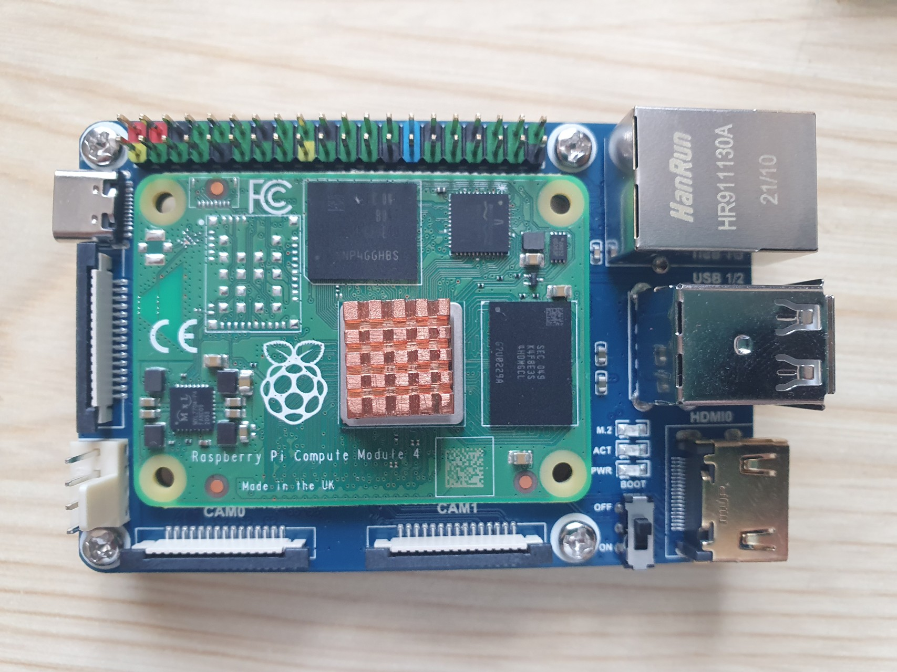

# Unterstützung für Raspberry Compute Module

*raspiBackup* unterstützt Raspberry Computemodule
mit einer SD Karte, eMMC Speicher und NVMe.

Wie man CM4 NVMe device auf Linux verfügbar macht, um ein NVMe Backup von *raspiBackup* zu restoren
ist der [englischsprachigen Seite](../support-for-raspberry-compute-module-4-and-nvme.md) beschrieben.

[.source]: https://www.linux-tips-and-tricks.de/de/raspibackupcategoried/613-unterstuetzung-fuer-raspberry-compute-module-4-und-nvme
[.source]: https://www.linux-tips-and-tricks.de/en/raspibackupcategorye/612-support-for-raspberry-compute-module-4-and-nvme
[.status]: rst
